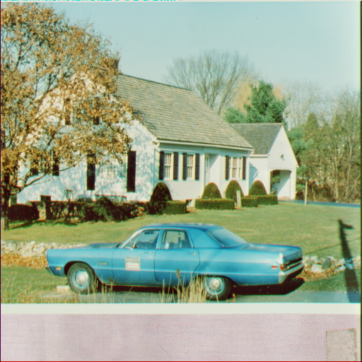
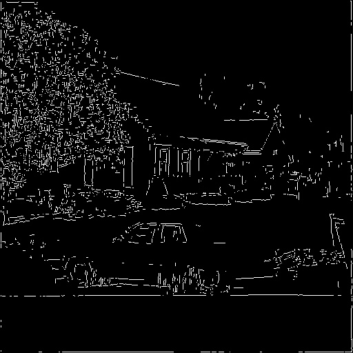

# CUDA at Scale Independent Project

## Description

The contoru_detection.cu C++ code is a comprehensive program that processes images using CUDA for parallel computation. The program performs several image processing tasks, including RGB to grayscale conversion, Gaussian blur, Sobel edge detection, non-maximum suppression, and double thresholding for edge tracking. 

## Getting Start

### Libraries and Definitions

* Standard Libraries: Includes standard C++ libraries such as <iostream>, <vector>, <string>, <thread>, and directory handling libraries <dirent.h> and <sys/types.h>.
* CUDA Libraries: Includes <cuda_runtime.h> for CUDA runtime functions.
* OpenCV Library: Includes <opencv2/opencv.hpp> for image reading and writing.

### Constants
* MAX_CONCURRENT_STREAMS: Defines the maximum number of concurrent CUDA streams, set to 4.

### CUDA Kernels
* RGB to Grayscale Conversion: Converts an RGB image to a grayscale image using a weighted sum of the RGB components.
* Gaussian Blur: Applies a Gaussian blur to the grayscale image using a 3x3 filter.
* Sobel Edge Detection: Computes the gradient magnitude and direction using the Sobel operator.
* Non-Maximum Suppression: Suppresses non-maximum gradient values to thin out the edges.
* Double Threshold and Edge Tracking by Hysteresis: Applies double thresholding to classify pixels as strong, weak, or non-edges and performs edge tracking by hysteresis.

### Image Processing Function
#### processImage:
* Takes an input image, output file name, and CUDA stream as arguments.
* Allocates device memory for various image buffers.
* Copies the input image to the GPU.
* Defines block and grid sizes for CUDA kernels.
* Executes the CUDA kernels in sequence: RGB to grayscale conversion, Gaussian blur, Sobel edge detection, non-maximum suppression, and double thresholding.
* Copies the processed image back to the host and writes it to the output file.
* Frees the allocated device memory.

### Main Function
#### main:
* Takes input and output directory paths as command-line arguments.
* Opens the input directory and reads all image files matching the .jpg or .jpeg extensions.
* Creates multiple CUDA streams for concurrent processing.
* Processes each image in parallel using the processImage function and the available CUDA streams.
* Cleans up by destroying the CUDA streams.

### Building Program
```
mkdir build
cd build
cmake ..
make
```

### Executing Program
```
./contour_detection ../sample_images ../outputs
```

## Example Input/Output

### input image: sample_images/house.jpg


### output image: outputs/house.jpg
